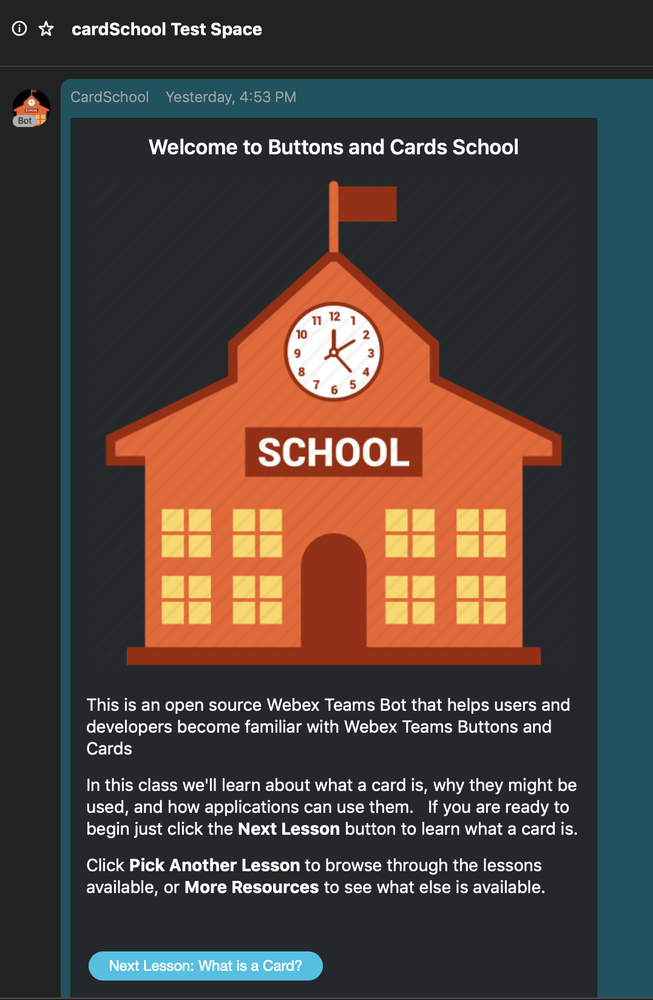

# webex-card-school
This project provides a Webex Teams bot to introduce Webex Teams users to [Buttons and Cards](https://developer.webex.com/docs/api/guides/cards).   Through a series of lesons, each presented as a card, users learn what cards are, why applications may choose to use them, and some of the mechanics around designing and using cards.

As an open source sample, this app itself is part of the training and lessons link back to this source as well as the card source files.  While any Webex Teams user may interact with the bot, the content is aimed primarily towards developers who have some experience with creating bots, and who wish to add Buttons and Cards to their existing (or new!) applications.

To interact with this bot now, simply add cardSchool@webex.bot to a Webex Teams space.

## More Information

* [How this app works](./doc/overview.md)
* [Running this project locally](.doc/running.md)
* [Creating your own lessons](.doc/lessons.md)

## Support and Contributions

Users who have issues interacting with the bot may join the [Ask Buttons and Cards School](https://eurl.io/#SJiS9VKTH) Webex Teams space.

Developers who wish to report issues or make contributions are invited to open an issue in this project or submit a pull request.

This project is continuing to evolve. For more details see the [To Do List](./doc/ToDo.md)

