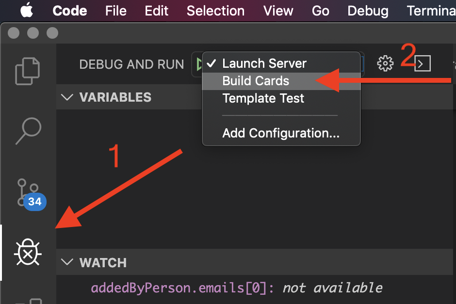

# Creating Lesson Content

Developers may wish to modify their own lesson content. Theoretically, a developer could create a completely different set of content and use the same basic bot logic.

Each lesson consists of an adaptive card json design file and a node.js file that processes button clicks. When our application starts it creates an array of lessonInfo objects that consist of both the card design and the methods that will process calls to `renderCard()` or `handleSubmit()` which will be called by our server's `framework.on('attachmentAction', ...)` handler method.

Lesson content is made up from the "main" lesson content which is unique to each lesson, and the "common" lesson content which includes the navigation and "More Resources" buttons that are shared by all cards.

A build process is used to *generate* the final lesson content json by combining the unique lesson content json with the common lesson json.   This readme will outline the process by which lesson content is created.

## Designing a lesson with no "extra buttons"
Most of the lesson content in this app consists solely of text and images along with the "common" navigation and resource buttons.   

There is a unique JSON file for each lesson in the lesson-content directory, for example [advantages.json](../lesson-content/advantages.json) defines the content for the "Advantages of Using Cards" lesson.  

Each lesson consists of an Adaptive Card schema that defines the elements of the lesson.  By convention the first element in the card's `body` array is a `TextBlock` where the `text` attribute is the title of the card, and the `weight` attribute is set to "bolder".

Card content can be edited by hand in your favorite editor or by using the [Webex Buttons and Cards Designer](https://developer.webex.com/buttons-and-cards-designer/).  For VSCode developers who are comfortable with hand editing their JSON the Adaptive Card Viewer plugin is useful for validating your card JSON.  If using the Designer, simply copy the JSON into a file in the lesson-content directory.

Once you have created your content, edit [lesson-conent.json](../lesson-content/lesson-order.json) in the lesson-content directory to specify the order in which  your conent should be delivered.  This file contains an array of objects that control the lesson order.   The default object simply contains an attribute `contentFile` which is the name of the file that has the lesson's design JSON, ie:

```json
[
  {
    "contentFile": "welcome-content.json"
  },
  {
    "contentFile": "what-is-a-card.json"
  },
  {
    "contentFile": "advantages.json"
  }
]
```
## Shared Content
The common content that is shared across all lessons is described in two files in the shared-lesson-content directory.  

* [next-lesson.json](../shared-lesson-content/next-lesson.json) defines the framework for the "Next Lesson" button.
* [common-actions.json](../shared-lesson-content/common-actions.json) defines the framework for the "Pick Another Lesson" and "Helpful Resources" buttons.

There is no need to edit these files unless you want to change the common navigation buttons or modify the content of the "Helpful Resources" button.

These JSON frameworks in these design files are dynamically updated during the card buiding process based on the rules specified in the lesson-order.json file.   You may notice that certain values in these json files use a syntax with curly braces, ie:

```json
    {
      "type": "Input.ChoiceSet",
      "id": "jumpToLessonIndex",
      "value": "{nextLessonIndex}",
      "choices": []
    },
```

Part of the build process includes replacing these "templatized" values with actual data that we learn during the build process.   The build process takes advantage of the nascent [Adaptive Card Templating SDK](https://docs.microsoft.com/en-us/adaptive-cards/templating/sdk) provided by Microsoft.   This is described further in Lesson 8 of the Buttons and Cards school.

## Building the cards.
Once all the lesson content is created, and each lesson is specified in the `lesson-order.json` file, the complete cards can be generated by running [build-cards.js](../build-cards.js).  This can be done by typing `npm run build` from a terminal, or, if you use VSCode, there is a debug option to run the card build process in the debugger.



The build process requires an environment variable that specifies the public IP address where the images will be served from, ie:

* IMAGE_HOSTING_URL="http://[XXXXXX].ngrok.io/images"

It can optionally use the following:

* APP_SRC_BASE_URL - URL for "See this App's Source" links
* CARD_SRC_BASE_URL - Base URL for "See this Card's Source" links
* ASK_SPACE_URL - EURL link to a Webex Teams space to support the app

Of course, as you begin to design your own content you may not have any of these links and have no need for these environment variables.

Once kicked off, the build process does the following.  (To track this in your debugger set a breakpoint on the first line of the `buildAllLessons()` function):

1) Reads in each lesson's design in the order specified in lesson-order.json 
2) Generates the Input.ChoiceSet array for the "Pick A Lesson" button that is shared by all lessons
3) For each lesson:
   1) Appends the Navigation and More Resources buttons to the class specific content
   2) Updates the `lessonIndex` returned by the "Next Lesson" button as appropriate for each card.
   3) Uses the Adaptive Card Tempalate SDKS `template.expand()` method to expand any templatized values
   4) Writes the fully generated card design to the `generated` directory.

(There is a bit of special logic at the end for the graudation card)  

If you intend to modify any of the shared lesson content it may become necessary to update build-cards.js as well, so it is useful to understand the logic.  The existing code does certain assumptions about where particular elements are in the overall card JSON.  In general this code is labeled with a comment:

```javascript
    if (nextLessonInfo) {
      // Build the "Next Lesson" button
      // This is a bit brittle as it assumes the JSON structure of nextLessonButton
      let nextLessonButton = nextLessonTemplate;
      if ((nextLessonButton.items[0].type !== 'ActionSet') || (nextLessonButton.items[0].actions[0].type !== 'Action.Submit')) {
        throw new Error(`${nextLessonTemplate} did not define the expected ActionSet and Action.Sumbit schema elements`);
      }
      nextLessonButton.items[0].actions[0].title = "Next Lesson: " + nextLessonInfo.title;
      nextLessonButton.items[0].actions[0].data.lessonIndex = nextLessonInfo.index;
      card.body.push(nextLessonButton);
    }
```

## Card Application Logic

We mentioned that our app creates an object for each card that includes both it's design (which we generated in the card building process), but also the functions that are called in response to incoming `attachmentAction` events, namely a `renderCard()` and a `handleSubmit()` method.   

This object is defined in [common-lesson-handler.js](../lesson-handlers/common-lesson-handler.js) in the lesson-handlers directory.

At initialization time each card's object is instantiated by getting a copy of the card's JSON and some other objects that allow it to write logs and navigate to other lessons as needed.

The `renderCard()` method's primary purpose is to have the bot send the card to the space.  While the function has a fair amount of logic in it primarily aimed at keeping track of the current state, and writing useful information to any logging and metrics data storage, the critical part of the function is:

```javascript
    bot.sendCard(this.cardJSON,
      `If you see this your client cannot render the card for ${this.lessonInfo.title}.\n` +
      `Try using a different Webex Teams client with this bot.`)
      .then((message) => {
        if ('id' in message) {
          bot.store('activeCardMessageId', message.id)
            .catch((e) => logger.error(`Failed to store active card message ID. Error:${e.message}`));
        }
      })
```

Here we call the framework's `bot.sendCard` method which requires a valid adpative card json object and fallback text which the Webex Team's client will post if it can't render the card.   Note that we also `bot.store()` the messageId of the newly created message.  We use this when handling subsequent `attachmentAction` events to ignore input coming from cards that are not the most recently posted lesson.

The common-lesson-handler also provides a `handleSubmit()` method for handling anything other than navigation.  In the "More Resources" section for each card there is an option to "Submit Feedback", so this app will capture that feedback by sending it to any [configured persistent storage](./storage.md) and/or posting it to a Webex Teams "feedback space" if [this has been configured](./running.md#GettingfeedbackinWebexTeams).  It will also notify the user that their feedback has been accepted.

## Adding Custom Handler logic

While the default `renderCard()` and `handleSubmit()` methods are sufficient for many lessons there may be circumstances where you want your lesson to override these defaults.

As an example, in our lesson on "Displaying Dynamic Information" we want to override the default `renderCard()` method so that we can update the card with the user's name, email, avatar and other information.

In our "Sending a Card to Webex Teams" lesson we want to add additional logic to process the "Try Posting This Message..." button that is specific to that card's lesson design.

The first step to adding your own custom logic is to update the [lesson-order.json](../lesson-content/lesson-order.json) document to include custom handlers for this lesson.  As an example:

```json
  {
    "contentFile": "sending-a-card-content.json",
    "customHandlerFile": "sending-a-card-handler"
  },
  {
    "contentFile": "how-this-app-sends-cards.json"
  },
  {
    "contentFile": "displaying-dynamic-content.json",
    "customHandlerFile": "displaying-dynamic-content-handler"
  },
```

The `customHandlerFile` field instructs the application logic in [server.js](../server.js) that loads in the cards at initialization time to include this custom handling logic:

```javascript
  for (let i = 0; i < numLessons; i++) {
    let customHandlers = null;
    let fileName = `${generatedDir}/lesson-${i}.json`;
    logger.verbose(`${lessons[i].title} is being loaded from ${fileName}`);
    let cardJson = require(fileName);
    if (lessons[i].customHandlerFile) {
      let CustomHandlers = require(`./lesson-handlers/${lessons[i].customHandlerFile}`);
      customHandlers = new CustomHandlers();
    }
    cardArray.push(new LessonHandler(cardJson, logger, lessons, lessons[i], customHandlers));
  }
```

The default handlers will check for a custom handler and call it if it exists.   Check out the code in [sending-a-card-handler.js](../lesson-handlers/sending-a-card-handler.js) or [displaying-dynamic-content-handler.js](../lesson-handlers/displaying-dynamic-content-handler.js) for examples on how to create a custom handler for your lessons.


## A note about the use of bot.reply()
In some circumstances our bot sends a threaded reply in response to button presses.  This happens in cases where the bot determines the user is interacting with a card that is not the most recently displayed lesson, or if the lesson content dictates the use of a threaded reply.

At the time of our intial publishing, the API that supports threaded replies is not yet GA.  If you wish to use this feature in your implementation of this bot, please open an issue on this project and we can work to get you early access to this feature.   Alternately, replace the `bot.reply()` function in `handleSubmit` functions with a call to `bot.say()` instead.

## More Information

* [Main README for project](../README.md)
* [Running this project locally](./running.md)
* [How this app works](./overview.md)
* [Using Persistent Storage](./storage.md)
* [Advanced Logging](./logging.md)
* Limiting access to your bot with ["beta mode"](./beta-mode.md) 
* [Ask Buttons and Cards School](https://eurl.io/#SJiS9VKTH) Webex Teams space.

